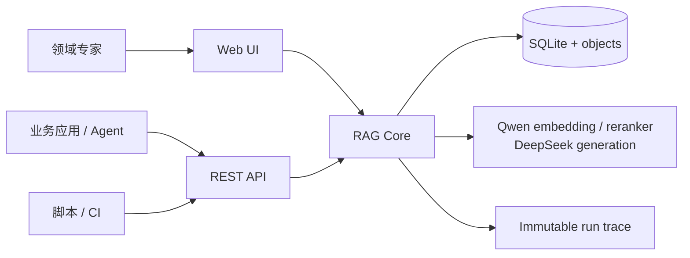

# Traceable Agentic RAG

[](https://github.com/kinnyuww/traceable-agentic-rag/actions/workflows/ci.yml)
[](LICENSE)

> **v0.1 Baseline** — local-first, traceable, evaluable, and usable as both a
> complete Web RAG application and an embeddable REST service.

一个本地优先、可独立使用、也可通过 REST 嵌入其他 Agent 的可追踪
Agentic RAG。v0.1 的重点不是声称“自动进化”，而是先把数据、索引、检索、
路由、证据、回答与评测变成可复现的工程基线。

已在 Apple M1 Pro 32 GB 上完成真实模型和 Docker 验证：文档上传与解析、
结构化切块、不可变索引版本、dense + BM25 + RRF 混合检索、Qwen rerank、
有界二轮 Agentic 检索、引用回答、逐阶段 trace、离线评测和 Web UI 均可运行。

## v0.1 的定位

知识库事实问题永远先检索，不允许生成模型因为“似乎知道答案”而跳过 RAG。
首轮证据充分时走低延迟单轮路径；证据弱、缺少问题要素或需要多跳时，才改写/
分解问题并再检索一次。系统最多检索 2 轮，第二轮最多 4 个子查询，最后回答、
请求澄清或明确拒答，没有无界 Agent 循环，也不会在线修改自己的配置。

在线证据主路径为：

`Rerank Top 6 → 单跳 floor 后最多 4 / 多跳保留全部 6 → Evidence Gate → 同一集合直接生成与引用`

单跳使用动态门槛 `max(0.02, top_rerank × 10%)` 降噪；多跳不使用该门槛删除
尾部证据，保留 Rerank Top 6。Gate 放行后不会再用另一套 Context Selection
删除证据；trace 会记录策略、筛选 IDs、Gate 审核 IDs、生成 IDs 和 citation IDs，
回答路径可以直接核对集合一致性。

这一版比较有辨识度的不是又包装了一条 RAG pipeline，而是：

- **结果与过程分开评测**：粗糙知识库中答案文本正确率为 90%，但完整链路干净率
  只有 40%，能在“暂时答对”时提前发现错误引用、提示注入暴露和路由失真。
- **检索每一层都可见**：dense、BM25、RRF、rerank、证据门、上下文筛选、生成与
  引用都保存候选文件、章节、分数、时延、模型、重试和不可变版本 ID。
- **应用与服务是同一个产品**：人可以用 Web UI，Agent 可以调用 REST；两者共享
  同一数据库、对象存储、索引、RAG Core 和 run trace。
- **Agentic 行为有边界**：什么时候第二轮、为什么停止、为何澄清或拒答都有明确
  状态和预算，适合后续做失败归因与受控实验。

## 一个系统，三条使用入口

三种方式共享同一套知识库、原始文档、不可变索引、RAG Core 和 run trace，
不是三份各自演化的实现。

| 使用方式 | 谁建立知识库 | 谁发起问答 | 最适合 |
|---|---|---|---|
| **全 Web UI** | 人在网页上传并建索引 | 人在网页问答 | 个人、领域专家、演示与排障 |
| **Web 建库 + Agent 调用** | 人在网页维护知识库 | 外部 Agent 调用 `/v1/query` 或 `/v1/retrieve` | 现有 Agent 增加私有知识能力 |
| **全 API 生命周期** | 程序创建、上传、轮询、建索引 | 程序或 Agent 调用 | 产品集成、批量导入、CI 与自动化 |



这里最重要的产品边界是：Web UI 是完整应用；REST 是同一个应用的服务入口。
未来增加 MCP 时，只需要把稳定 REST 能力映射为 tools，不需要重写检索和
Evidence Gate。

## 五分钟启动

当前验证目标为 Apple Silicon Mac、Docker Desktop，以及启用了 host-side TCP
的 Docker Model Runner。

```bash
git clone https://github.com/kinnyuww/traceable-agentic-rag.git
cd traceable-agentic-rag
./scripts/bootstrap-models.sh
./scripts/verify-models.sh
./scripts/run-docker.sh -d
```

启动后：

- Web 应用：<http://127.0.0.1:8080/app/>
- REST/OpenAPI：<http://127.0.0.1:8080/docs>
- 健康检查：<http://127.0.0.1:8080/v1/health>

数据保存在 Docker volume `traceable-rag-agent-data`。真实 API key 只通过仓库外
secret 文件或进程环境注入，不能写入仓库、镜像、浏览器或 trace。

首次配置 DeepSeek、原生开发模式、备份和故障检查见
[本地运维指南](docs/OPERATIONS.md)。没有生成模型时也可启动，系统会使用可引用
的抽取式降级回答。

## 三条路线的实际操作

### 1. 全 Web UI

在网页中新建知识库，上传 PDF、DOCX、Markdown 或 UTF-8 TXT，等待解析完成，
建立并激活索引，然后直接问答、查看引用和运行轨迹。适合个人或领域专家操作。

```text
打开 /app/
  → 新建知识库
  → 上传一个或多个文档
  → 等待文档状态 ready
  → 构建并激活索引
  → 提问
  → 核对 citation 与 trace
```

网页不是单独的 demo：它操作的知识库随后可以被任何 REST 客户端继续使用。

### 2. Web UI 建库，Agent 通过 API 调用

先由人通过 Web 管理知识库，再让现有 Agent 使用稳定的知识库 ID 调用。
知识库更新后只需发布新的 active index，Agent 无需更换 ID。

```bash
curl -s http://127.0.0.1:8080/v1/query \
  -H 'Content-Type: application/json' \
  -d '{
    "knowledge_base_id": "kb_REPLACE_ME",
    "question": "这份制度中员工每年有多少天年假？"
  }'
```

也可以按 Web UI 中的名称调用可运行示例：

```bash
PYTHONPATH=src uv run --no-sync python examples/rest_workflow.py query \
  --knowledge-base-name '粗糙知识库' \
  --question 'ZX-417 的最高工作温度是多少？'
```

`/v1/query` 返回的不是一个无法追查的字符串，而是一个完整的 Agent 工具结果：

```json
{
  "run_id": "run_...",
  "route": "single_pass_rag",
  "answer": "…… [S1]",
  "citations": [
    {
      "id": "S1",
      "chunk_id": "chk_...",
      "quote": "……",
      "source": {
        "document_id": "doc_...",
        "filename": "manual.md",
        "section": "安全限制"
      }
    }
  ],
  "rounds": 1,
  "latency_ms": 842.7,
  "trace_url": "/v1/runs/run_..."
}
```

上层 Agent 应保留 `citations`、`route` 和 `run_id`，而不是只截取 `answer`。
如果上层 Agent 想自己生成最终答案，可改调 `/v1/retrieve` 获取 rerank 后的证据。

### 3. 全 API 建库与调用

上层程序可以通过 REST 创建知识库、批量上传、轮询解析 job、建立索引、查询并
读取完整 run trace。仓库中的示例覆盖整个生命周期：

```bash
PYTHONPATH=src uv run --no-sync python examples/rest_workflow.py build \
  --name '产品手册' \
  --description '由上层 Agent 通过 REST 创建' \
  --question '安装前需要满足什么条件？' \
  ./manual.md ./faq.pdf
```

这个示例实际执行以下生命周期，并正确轮询异步 job，而不是使用固定 sleep：

```text
create knowledge base
  → upload documents
  → wait for every parse job
  → build immutable index
  → wait and atomically activate it
  → query
  → preserve citations and run trace
```

三条路线的完整契约和调用顺序见 [使用模式指南](docs/USAGE_MODES.md)。

## Agent 应该调用 `/query` 还是 `/retrieve`

| 接口 | 系统负责什么 | 上层 Agent 负责什么 |
|---|---|---|
| `POST /v1/query` | 检索、Evidence Gate、最多两轮、生成、引用、拒答 | 提供问题并消费结构化结果 |
| `POST /v1/retrieve` | Dense + BM25 + RRF + rerank，返回证据块 | 自己判断充分性、生成与引用 |
| `GET /v1/runs/{run_id}` | 返回完整不可变 trace | 观察、排障、评测或保存审计链接 |

推荐大多数 Agent 使用 `/v1/query`。只有上层已经拥有严格的证据审核与生成策略时，
才直接使用 `/v1/retrieve`，否则很容易绕开本项目最重要的 Gate 和拒答能力。

## 当前切块基线

v0.1 采用确定性的结构感知切块：先按 PDF 页、DOCX/Markdown 标题或文本 section
解析，再在 section 内优先寻找段落/句子边界，目标约 1100 字符、重叠约 160
字符。每个 chunk 保存文档、页码、章节、字符 offset 和 ordinal，并把结构信息
作为本地 `contextual_text` 加入 embedding、BM25 和 rerank。

它不是 LLM 语义切块，也没有把 Anthropic-style Contextual Retrieval 冒充为已
实现功能。现有边界、中文长文本风险和后续候选实验详见
[切块策略说明](docs/CHUNKING_STRATEGY.md)。

## 模型与运行边界

- Embedding：`ai/qwen3-embedding:0.6B-F16`，1024 维
- Reranker：`ai/qwen3-reranker:0.6B`
- 本地推理：Docker Model Runner 的 llama.cpp 引擎；Apple Silicon 使用 Metal
- 生成：OpenAI-compatible 适配器；当前验证配置为 DeepSeek 官方
  `deepseek-v4-flash`
- Dense store：v0.1 使用精确 cosine search，适合本地基线与诊断；大规模部署的
  替换边界是 HNSW/Qdrant/pgvector adapter

生成模型可关闭；失败时系统保留可引用的抽取式降级。配置见
[本地运维指南](docs/OPERATIONS.md)。

## REST 能力

`/v1` 契约包含：

- 创建、列出和读取知识库；
- 批量上传、解析和列出文档；
- 创建不可变索引版本、读取 job 与阶段 trace；
- 单独调用 hybrid retrieval；
- 调用完整 Agentic query，获得引用、route、轮次、run ID 和 trace URL；
- 读取不可变 run trace；
- 提交固定金标评测并读取结果。

未来 MCP 只需把 `query`、`retrieve`、`upload_document`、`get_run` 等工具映射到
这些 schema，不需要重写检索核心。

完整、可交互的请求/响应 schema 位于启动后的
<http://127.0.0.1:8080/docs>。接口模型定义见
[`src/ragagent/schemas.py`](src/ragagent/schemas.py)，端点实现见
[`src/ragagent/api.py`](src/ragagent/api.py)。

## 当前明确边界

- v0.1 是可追踪、可评测的 baseline，不宣称已经在线自进化。
- DOCX 表格、OCR、复杂 PDF 布局和多模态尚未进入稳定解析路径。
- Dense 当前为精确余弦检索，适合本地小中型知识库；尚未承诺百万 chunk 规模。
- 生成启用时，最终 Evidence Set 会发送到配置的外部 DeepSeek endpoint；私有材料
  的部署者必须自行确认数据出境策略。
- 当前没有多租户、RBAC 和公网部署安全层，不应把端口直接暴露到互联网。
- Rerank score 只表示查询相关性，不表示来源真实、权威或最新。

## 验证与报告

- [v0.1 工程决策报告：SQL 检索、Chunk 策略与优化顺序](reports/explainer-rag-v01-decision-report.html)
- [多颗粒度框架与心智模型报告](reports/AGENTIC_RAG_FRAMEWORK_MENTAL_MODEL.md)
- [交互式 Agentic RAG 心智模型](reports/explainer-agentic-rag-mental-model.html)
- [真实示例导入与 Ragas 评测报告](reports/LIVE_DEMO_AND_RAGAS_EVALUATION.md)
- [粗糙知识库：故障实验室与逐层定位指南](reports/FAILURE_LAB_GUIDE.md)
- [完整设计与评测报告](reports/TRACEABLE_AGENTIC_RAG_V0.1_REPORT.md)
- [系统架构](docs/ARCHITECTURE.md)
- [不稳定面与 Trace 契约](docs/TRACE_AND_FAILURE_MODEL.md)
- [Docker 黑盒结果](reports/results/docker-e2e.json)
- [QASPER / MultiHop-RAG / 双语控制集结果](reports/results/public-benchmark-real-model.json)
- [MIRACL-zh 结果](reports/results/miracl-zh-real-model.json)

当前 EvidenceSet 改造的回归结果为 Ruff 全通过、pytest `34 passed`。粗糙知识库
用于暴露失败而不是制造漂亮分数：答案文本可正确但完整证据链仍可能不干净，这正是
trace、拒答和后续 Harness Engineering 存在的原因。

开发验证：

```bash
UV_CACHE_DIR=/tmp/ragagent-uv-cache uv sync --extra dev --no-editable --python 3.12
UV_CACHE_DIR=/tmp/ragagent-uv-cache uv run --no-sync ruff check .
UV_CACHE_DIR=/tmp/ragagent-uv-cache uv run --no-sync pytest -q
```

## Roadmap：从 Baseline 到 Harness Engineering

v0.1 有意不做 OCR/复杂表格、多租户/RBAC、MCP、反馈审批、自动失败归因、
自动参数实验、自调优和 HITL 发布门禁。下一阶段计划围绕下面的闭环展开：

```text
用户/专家反馈
  → 金标答案与证据审批
  → 逐层失败归因
  → 生成单变量候选实验
  → development set 对比
  → sealed regression test
  → 质量 / 成本 / 时延门禁
  → HITL 批准
  → 新索引或配置版本发布 / 可回滚
```

候选实验包括切块、解析、embedding、BM25、fusion、reranker、context selection、
prompt 和 evidence gate。所谓 self-tuning 首先是“离线提出并验证候选”，不是让
线上 Agent 根据一次点赞就直接改生产配置。

后续接入层可以增加 MCP；更后面才考虑多租户、权限、漂移监控和受限自动提升。

## Repository layout

```text
src/ragagent/           API、Agent、检索、解析、索引、Web UI
examples/               可运行 REST 全生命周期客户端
scripts/                模型启动、部署验证、数据集与评测脚本
tests/                  API、EvidenceSet、解析、前端契约测试
docs/                   使用、架构、切块、运维与失败模型
reports/                设计报告、真实评测与故障实验室结果
compose.yaml            API + worker + persistent volume
```

## License

Apache-2.0.
