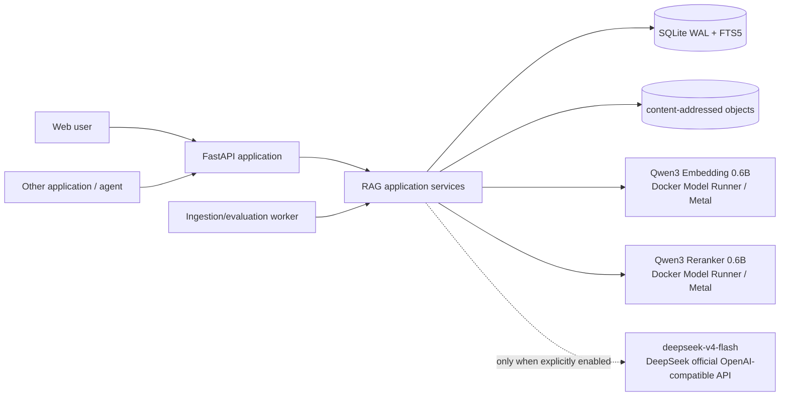
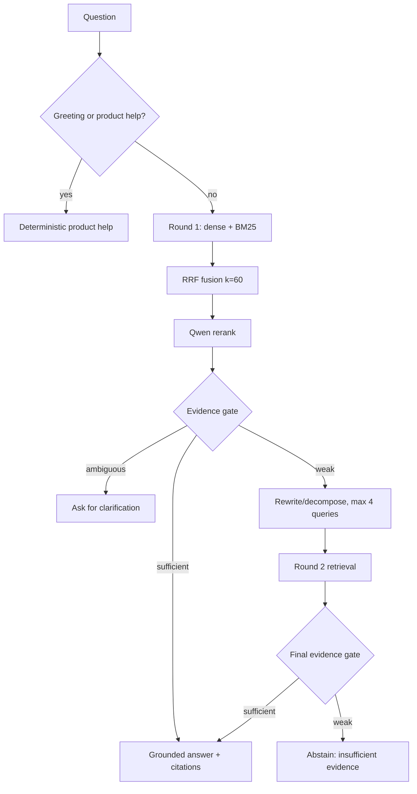

# Traceable Agentic RAG v0.1 Architecture

## 1. What the product is

The primary product is a standalone local RAG Agent application. A user can
create a knowledge base, upload documents, build an immutable index, ask a
question, inspect citations, and open the complete execution trace in the Web
UI. The same application core is exposed through versioned REST/OpenAPI routes
so another application or agent can call it without driving the UI.

This release uses “Agentic RAG” in a narrow, testable sense: the online path can
observe first-pass evidence, choose a route, rewrite or decompose a failed
search, perform one more retrieval round, and decide when to stop. It does not
mean an unconstrained model loop, and it does not mean online self-modification.

## 2. Offline data path

1. `POST /v1/knowledge-bases` creates a workspace-local knowledge base.
2. Multipart upload accepts PDF, DOCX, Markdown, or UTF-8 TXT, enforces a size
   limit and safe filename, hashes bytes with SHA-256, and stores an immutable
   content-addressed object.
3. A parse job extracts sections and preserves page/section/character location.
   Its complete stage history is stored in `job_events`.
4. The structure-aware chunker keeps document, section, page, overlap, and
   source offsets. v0.1 does not claim to implement LLM-generated Contextual
   Retrieval summaries; requesting `contextualize=true` fails explicitly.
   The exact 1100-character target, 160-character overlap, boundary rules and
   known limitations are documented in [CHUNKING_STRATEGY.md](CHUNKING_STRATEGY.md).
5. Qwen3-Embedding generates 1024-dimensional vectors. SQLite FTS5 stores a
   parallel BM25 index, including Latin tokens and Chinese character/bigram
   terms.
6. Chunks, source locations, vectors, the document manifest, model identity and
   index configuration are persisted under a new immutable index-version ID.
7. The index is activated atomically only after all chunks have been embedded
   and persisted successfully.

The v0.1 dense store performs exact cosine search. This is intentional for
small local collections and diagnostic correctness; an HNSW/Qdrant adapter is
the scale-out boundary.

## 3. Online bounded agent path

“Simple question” does not mean “let the LLM answer from memory.” Every
knowledge-base fact question performs first-pass retrieval. The fast path is a
single deterministic hybrid retrieval when its evidence clears the gate. Only
weak or multi-facet evidence triggers the second round. Budgets are two rounds,
four subqueries, and one final answer call.

The evidence gate combines reranker relevance, lexical query coverage, and
 source diversity for multi-hop-looking questions. An enabled LLM may grade only
the gray zone; deterministic rules remain the fallback and the trace records
which method was used.

Before generation, context selection keeps at most four candidates that clear
both an absolute rerank floor and 10% of the top rerank score. This prevents a
small knowledge base from padding every answer with near-zero-score chunks and
reduces prompt-injection exposure from irrelevant documents.

## 4. Model and failure boundaries

- Embedding and reranking are local by default through HTTP-compatible
  adapters. Docker Model Runner uses llama.cpp with Metal on Apple Silicon.
- Only transient transport errors and HTTP 5xx are retried, at most five total
  attempts with bounded exponential backoff. HTTP 4xx fails immediately.
- A reranker outage degrades to a lexical reranker and records the error.
- A final-generation outage degrades to a cited extractive answer and records
  the error.
- An embedding outage cannot safely use an incompatible vector fallback; index
  jobs or query runs fail visibly instead of silently corrupting the index.
- The external LLM is disabled unless a valid server-side key and explicit
  configuration are present. Document content is treated as untrusted data in
  all model prompts.

## 5. Persistence model

- `knowledge_bases`: local user workspaces and active index pointer.
- `documents`: immutable uploads, hash, parse status and source artifact.
- `index_versions`: immutable config and document manifest.
- `chunks` + `chunks_fts`: source text, location, dense vector and BM25 data.
- `jobs` + `job_events`: current state and historical ingestion/evaluation
  events.
- `runs` + `trace_events`: answer, route, metrics and ordered online trace.
- `evaluations`: fixed examples, per-example run IDs and aggregate metrics.

SQLite WAL and short-lived connections allow the API and worker containers to
share one local volume. v0.1 is a single-workspace developer product, not a
multi-tenant server.

## 6. Why REST first and MCP later is safe

REST is the stable application boundary, not a competing product. The Web UI
uses it, and an MCP server can later map tools such as `list_knowledge_bases`,
`upload_document`, `retrieve`, `query`, and `get_run` onto the same schemas.
No retrieval logic needs to move into MCP. The remaining MCP work is transport,
tool/resource descriptions, authentication, streaming, and upload semantics.
The human-only, UI-to-API, and API-only workflows are documented in
[USAGE_MODES.md](USAGE_MODES.md).

## 7. Explicit v0.1 exclusions

- feedback capture, failure attribution and expert adjudication workflows;
- automatic prompt/chunk/model/parameter experiments;
- automatic promotion, rollback, HITL release gates and online self-tuning;
- OCR, layout-aware tables, images, code AST chunking, GraphRAG and parent-child
  retrieval;
- MCP server and multi-tenant access control.

These exclusions preserve a trustworthy baseline. Harness Engineering can use
the versioned inputs, traces and evaluations produced here without changing the
online execution contract.
