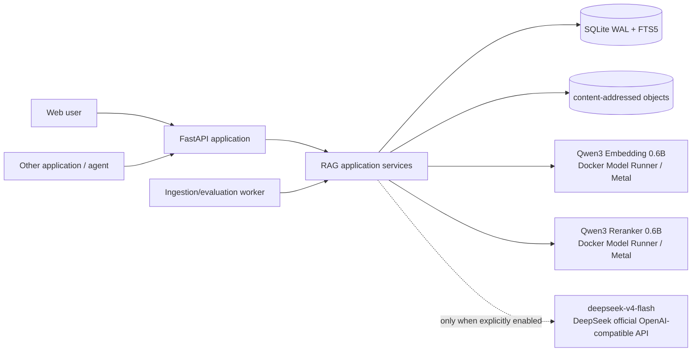
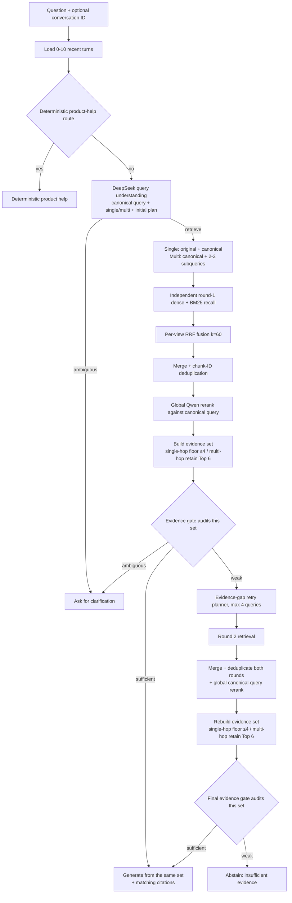

# Traceable Agentic RAG v0.2 Architecture

## 1. What the product is

The primary product is a standalone local RAG Agent application. A user can
create a knowledge base, upload documents, build an immutable index, ask a
question, inspect citations, and open the complete execution trace in the Web
UI. The same application core is exposed through versioned REST/OpenAPI routes
so another application or agent can call it without driving the UI.

This release uses “Agentic RAG” in a narrow, testable sense: the online path can
observe first-pass evidence, choose a route, rewrite or decompose a failed
search, perform one more retrieval round, and decide when to stop. It does not
mean an unconstrained model loop, and it does not mean online self-modification.

## 2. Offline data path

1. `POST /v1/knowledge-bases` creates a workspace-local knowledge base.
2. Multipart upload accepts PDF, DOCX, Markdown, or UTF-8 TXT, enforces a size
   limit and safe filename, hashes bytes with SHA-256, and stores an immutable
   content-addressed object.
3. A parse job extracts sections and preserves page/section/character location.
   Its complete stage history is stored in `job_events`.
4. The adaptive chunker keeps document, section, page, overlap, and source
   offsets. Meaningful Markdown/DOCX headings stay on the deterministic
   structure path; long generic TXT/PDF sections use embedding-based semantic
   breakpoints. It does not generate evidence-like summaries;
   `contextualize=true` still fails explicitly. Exact rules are documented in
   [CHUNKING_STRATEGY.md](CHUNKING_STRATEGY.md).
5. Qwen3-Embedding generates 1024-dimensional vectors. SQLite FTS5 stores a
   parallel BM25 index, including Latin tokens and Chinese character/bigram
   terms.
6. Chunks, source locations, vectors, the document manifest, model identity,
   requested/resolved chunk strategy and dense backend are persisted under a
   new immutable index-version ID. Small indexes use a cached exact cosine
   matrix; selected large indexes also create a persisted USearch HNSW sidecar.
7. The index is activated atomically only after all chunks have been embedded
   and persisted successfully.

Dense search is selectable per index: `exact`, `hnsw`, or `auto`. Auto keeps
exact cosine below 100,000 chunks and chooses HNSW at/above the boundary.
SQLite FTS5 BM25 remains the parallel sparse channel in every mode. See
[DENSE_SEARCH_STRATEGY.md](DENSE_SEARCH_STRATEGY.md) for score semantics,
HNSW/IVF tradeoffs and the local benchmark.

## 3. Online bounded agent path

“Simple question” does not mean “let the LLM answer from memory.” Every
knowledge-base fact question performs first-pass retrieval. The fast path is a
single deterministic hybrid retrieval when its evidence clears the gate. Only
weak or multi-facet evidence triggers the second round. Budgets are two rounds,
four subqueries, and one final answer call.

The initial query-understanding stage runs before the first retrieval whenever
the external chat model is enabled. It receives the original query, the
knowledge-base name/description, and optional conversation history isolated by
`conversation_id`. `memory_turns` is bounded to 0-10, defaults to 5 in the Web
application, and 0 disables memory. It returns a canonical standalone query,
single-hop/multi-hop classification, entities, constraints, clarification
state, and at most three multi-hop subqueries. It never answers the question.
If the model is disabled or fails, deterministic rules preserve a usable path.

Single-hop retrieval uses the original and canonical query as separate recall
views only when they differ. Multi-hop retrieval uses the canonical query plus
2-3 atomic subqueries, with four total views at most. Views are never
concatenated: they recall independently through bounded parallel execution
(default concurrency 2, configurable from 1 to 4). Their
candidates are merged by chunk ID, then placed on one score scale by a global
rerank against the canonical query. The trace records every view, per-view
candidates, merge counts, duplicates, global scores, model fallback, and
latency. `retrieval_concurrency` may override the server default per request;
the effective value and whether it came from the default or request are traced
for controlled Harness experiments.

The query-understanding classification is the single source of truth for the
evidence policy; it is not recalculated after reranking. The system constructs
one evidence set before the gate. Single-hop candidates must clear
`max(0.02, top_rerank_score × 0.10)` and at most four are retained; Top 1 is the
fallback if no candidate clears the floor. Multi-hop retains the complete
reranker Top 6 without applying that floor. The selection policy and every
discard are traced before gate evaluation.

The evidence gate audits only this set. It combines Top 1 reranker relevance
with joint lexical query coverage over all selected chunks, and multi-hop source
diversity is measured over the complete selected set. The optional gray-zone
LLM classifier sees that same complete set. If the gate answers, the exact
chunk IDs are passed directly to generation and citations—there is no second
context-selection rule. If it retries, first- and second-round candidates are
merged and deduplicated before the evidence set is rebuilt and audited again.
Retrieval rank and reranker score are included in the gate and generation
prompts as relevance hints, with an explicit warning that neither establishes
factual correctness, source authority, trustworthiness, or recency.

If the gate returns `retry`, the query-understanding state, current evidence
set, gate reason, and `missing_facts` go to the bounded retry planner. Query
understanding is not rerun. The planner generates only missing-evidence queries;
round-2 candidates are merged with round 1 and globally reranked again against
the same canonical query before the final gate.

This is a deliberate recall/precision split: single-hop questions normally need
one compact fact and benefit from tail-noise suppression, while a multi-hop
bridge may appear at rank five or six. Keeping six is still a bounded context,
not a claim that every reranked item is trustworthy; the gate checks the full
set and generation must judge source content and corroboration.

## 4. Model and failure boundaries

- Embedding and reranking are local by default through HTTP-compatible
  adapters. Docker Model Runner uses llama.cpp with Metal on Apple Silicon.
- Only transient transport errors and HTTP 5xx are retried, at most five total
  attempts with bounded exponential backoff. HTTP 4xx fails immediately.
- A reranker outage degrades to a lexical reranker and records the error.
- A final-generation outage degrades to a cited extractive answer and records
  the error.
- An embedding outage cannot safely use an incompatible vector fallback; index
  jobs or query runs fail visibly instead of silently corrupting the index.
- The external LLM is disabled unless a valid server-side key and explicit
  configuration are present. Document content is treated as untrusted data in
  all model prompts.

## 5. Persistence model

- `knowledge_bases`: local user workspaces and active index pointer.
- `documents`: immutable uploads, hash, parse status and source artifact.
- `index_versions`: immutable config and document manifest.
- `chunks` + `chunks_fts`: source text, location, dense vector and BM25 data.
- `data/vector-indexes`: rebuildable HNSW graph and chunk-ID manifest for index
  versions whose resolved backend is HNSW.
- `jobs` + `job_events`: current state and historical ingestion/evaluation
  events.
- `runs` + `trace_events`: conversation-isolated question/answer memory, route,
  metrics and ordered online trace.
- `evaluations`: fixed examples, per-example run IDs and aggregate metrics.

SQLite WAL and short-lived connections allow the API and worker containers to
share one local volume. v0.2 is a single-workspace developer product, not a
multi-tenant server.

## 6. Why REST first and MCP later is safe

REST is the stable application boundary, not a competing product. The Web UI
uses it, and an MCP server can later map tools such as `list_knowledge_bases`,
`upload_document`, `retrieve`, `query`, and `get_run` onto the same schemas.
No retrieval logic needs to move into MCP. The remaining MCP work is transport,
tool/resource descriptions, authentication, streaming, and upload semantics.
The human-only, UI-to-API, and API-only workflows are documented in
[USAGE_MODES.md](USAGE_MODES.md).

## 7. Explicit v0.2 exclusions

- feedback capture, failure attribution and expert adjudication workflows;
- automatic prompt/chunk/model/parameter experiments;
- automatic promotion, rollback, HITL release gates and online self-tuning;
- OCR, layout-aware tables, images, code AST chunking, GraphRAG and parent-child
  retrieval;
- MCP server and multi-tenant access control.

These exclusions preserve a trustworthy baseline. Harness Engineering can use
the versioned inputs, traces and evaluations produced here without changing the
online execution contract.
