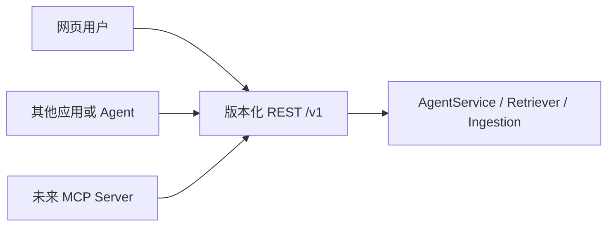
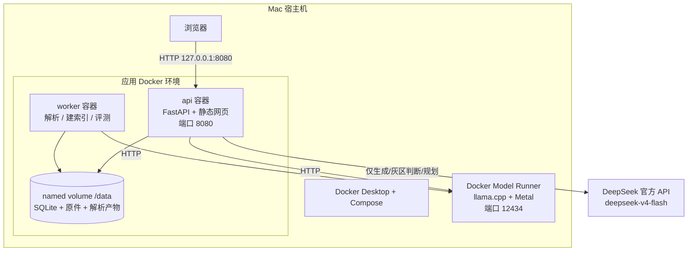
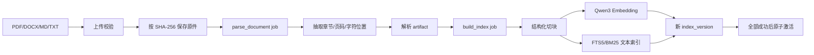
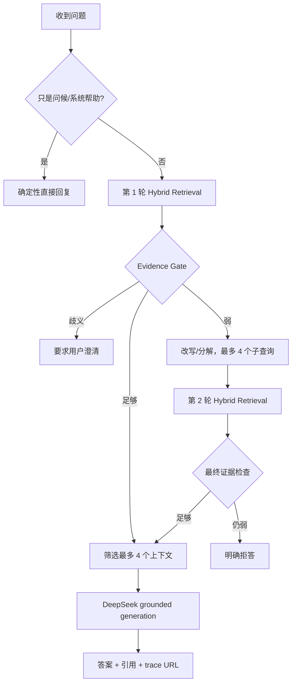
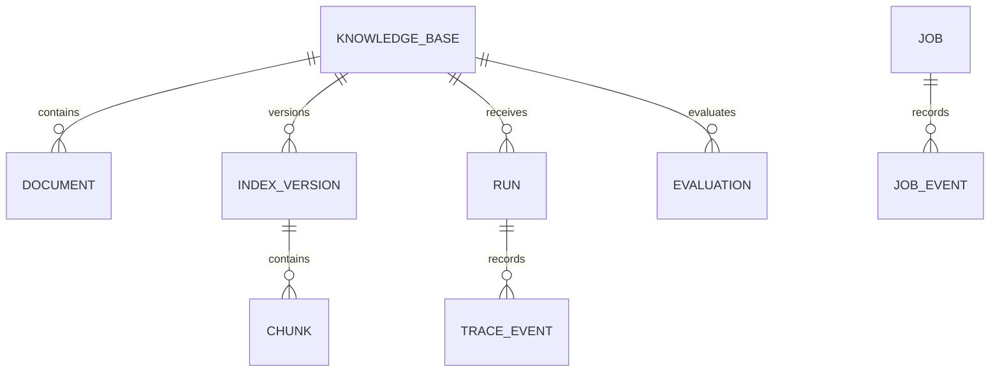

# Traceable Agentic RAG v0.1：从心智模型到代码落点

> 这份报告回答四个问题：这个产品到底是什么；文档和问题怎样在系统中流动；它为什么算 Agentic RAG；Docker、FastAPI、本地模型和外部 API 分别扮演什么角色。

## 0. 先给结论

这是一个“可独立使用的 RAG Agent 应用”，同时也是“可被别的应用或 Agent 调用的 RAG 服务”。两种使用方式进入的是同一个核心，不存在一套网页逻辑和另一套 API 逻辑：

```text
人 ──网页──┐
           ├── REST API ── 同一套 RAG Agent 核心 ── 答案、引用、完整轨迹
其他应用 ─┘
未来 MCP ─┘
```

v0.1 的 Agentic 含义是“有界的观察—判断—行动”：系统先检索，检查证据是否足够；足够就回答，不足就改写或拆解问题再检索一次；仍不足就拒答。它不是无限自主循环，也不会在线修改自己的代码、提示词或索引参数。

最重要的工程边界是：

- **FastAPI** 是写 HTTP 接口的 Python Web 框架。
- **Docker** 是把程序、依赖和启动方式装成可重复运行环境的工具。
- **Docker Compose** 是同时启动并连接 API、worker、存储卷等多个运行单元的编排文件。
- **Docker 本身不替 RAG 生成业务接口**；`/v1/query` 等接口来自容器里运行的 FastAPI。

---

## 1. 第一层心智模型：一座“可审计图书馆”

把系统想成一座带完整工作日志的图书馆：

| 系统概念 | 图书馆类比 | 实际作用 |
|---|---|---|
| 知识库 | 独立书库 | 隔离某个项目或领域的文档 |
| 上传文件 | 新书入库 | 保存 PDF、DOCX、Markdown、TXT 原件 |
| 解析器 | 拆包和编目员 | 抽取正文、页码、章节和字符位置 |
| Chunk | 可检索的段落卡片 | 把长文档变成能召回、能引用的小单元 |
| Embedding | 语义坐标 | 让表达不同但含义相近的内容靠近 |
| BM25/FTS5 | 关键词卡片柜 | 擅长人名、术语、数字和原文措辞 |
| RRF | 两份候选清单的合并规则 | 合并语义检索和关键词检索的名次 |
| Reranker | 资深馆员复核 | 针对当前问题重新排列候选段落 |
| Evidence gate | 证据审查员 | 判断现有材料能否支撑答案 |
| 第二轮检索 | 馆员换一种问法再找 | 补齐遗漏问题要素或多跳证据 |
| DeepSeek V4 Flash | 报告撰写员 | 只依据选中的证据组织最终回答 |
| Citation | 书架、页码与段落凭条 | 让用户回到原始依据核查 |
| Trace | 全流程工作日志 | 记录在哪一步找到、丢掉或误判了证据 |

这个类比里最关键的分工是：**模型负责写报告，不负责凭记忆替图书馆藏书回答事实问题。**

---

## 2. 第二层心智模型：产品、控制面与数据面

### 2.1 产品形态

本项目首先是一个应用：用户打开网页后可以创建知识库、上传文件、建立索引、提问、查看引用和运行轨迹。

它同时保留服务能力：网页本身也通过 REST 调用后端，因此外部程序能使用完全相同的接口。未来增加 MCP 时，只需要做一个“协议适配层”，不需要重写 RAG。



### 2.2 两条主数据流

系统不是一条流水线，而是两条不同时间尺度的流水线：

1. **离线摄取流**：文件进入系统后，解析、切块、向量化并建立不可变索引；通常耗时更久，交给 worker。
2. **在线查询流**：用户问题进入后，检索、判断、必要时再检索、生成并返回；用户在等待，因此有严格的轮次和上下文预算。

两条流通过“已激活的不可变索引版本”连接。在线查询不会直接读取刚上传、尚未解析或尚未入索引的文件。

---

## 3. 第三层心智模型：部署拓扑——什么在哪里运行

当前 M1 Pro 部署分成三个边界：Mac 宿主机、应用容器、外部云服务。



### 3.1 Docker 里有什么

`api` 和 `worker` 使用同一个镜像 `traceable-rag-agent:local`，镜像中包含：

- Python 3.12 运行时；
- 本项目源码和安装后的 `ragagent` Python 包；
- FastAPI、Uvicorn、解析和检索所需 Python 依赖；
- Web UI 的 HTML/CSS/JavaScript 静态文件；
- 固定的非 root 用户、工作目录和健康检查；
- 默认启动命令。

同一个镜像用两个不同命令启动，形成两个进程角色：

| 容器 | 进程 | 负责 | 为什么分开 |
|---|---|---|---|
| `api` | `uvicorn ragagent.main:app` | 网页、REST、查询请求、健康检查 | 保持交互请求及时响应 |
| `worker` | `ragagent-worker` | 解析文档、建立索引、执行评测 | 慢任务不阻塞 API |

### 3.2 Docker 里没有什么

| 不在应用容器内的内容 | 所在位置 | 原因 |
|---|---|---|
| Qwen3 Embedding 0.6B F16 | Mac 上 Docker Model Runner | Linux 应用容器不能直接使用 macOS Metal；宿主模型服务可用 Apple GPU |
| Qwen3 Reranker 0.6B | Mac 上 Docker Model Runner | 同上，并且可独立换模型 |
| DeepSeek V4 Flash 模型 | DeepSeek 官方服务端 | 通过 HTTPS API 调用，不把大生成模型部署到本机 |
| DeepSeek API key | 宿主机仓库外 secrets 文件，启动时注入 | 防止密钥进入源码、镜像和 Git |
| 持久数据本体 | Docker named volume `traceable-rag-agent-data` | 容器重建后数据仍保留 |

注意：“named volume 由 Docker 管理”不等于“数据被烤进镜像”。镜像像安装光盘，容器像正在运行的程序，volume 像独立硬盘。

---

## 4. Docker、FastAPI、REST 到底是什么关系

可以把它们分别看作“包装箱、接待台和办事协议”：

| 概念 | 它解决的问题 | 在本项目中的实例 |
|---|---|---|
| Docker image | 在不同机器上得到一致的软件环境 | `traceable-rag-agent:local` |
| Docker container | 把镜像作为隔离进程运行 | `api`、`worker` |
| Docker Compose | 声明多个容器如何启动、连接、共享数据 | `compose.yaml` |
| FastAPI | 编写处理 HTTP 请求的后端程序 | `src/ragagent/main.py`、`api.py` |
| REST | 约定 URL、HTTP 方法和 JSON 数据格式 | `POST /v1/query` 等 |
| OpenAPI | 机器可读的 REST 接口说明书 | `http://127.0.0.1:8080/docs` |
| MCP | 面向模型/Agent 的工具与资源协议 | v0.1 未实现；以后适配 REST/Core |

### 4.1 一个请求实际穿过了什么

假设网页调用：

```http
POST http://127.0.0.1:8080/v1/query
Content-Type: application/json

{
  "knowledge_base_id": "kb_123",
  "question": "正式员工每年有多少天年假？"
}
```

真实路径是：

```text
浏览器
  → Mac 的 127.0.0.1:8080
  → Compose 端口映射
  → api 容器的 8080
  → Uvicorn
  → FastAPI 路由 /v1/query
  → AgentService.query()
  → SQLite / 本地模型服务 / DeepSeek
  → JSON 响应
```

因此 Docker 负责“让这套程序稳定地运行起来”，FastAPI 负责“接住这个请求并调用业务代码”，REST 负责“调用者与服务怎样说话”。

### 4.2 Docker 为什么方便部署

不用 Docker 时，用户要自己对齐 Python 版本、系统库、依赖、启动命令、目录权限、环境变量和进程管理。Docker 把这些约束固化在 `Dockerfile` 和 `compose.yaml` 中：

- 一条命令构建、启动 API 和 worker；
- 同一个镜像避免 API 与 worker 依赖漂移；
- 健康检查判断服务是否真正可用；
- `restart: unless-stopped` 处理异常退出和开机后恢复；
- volume 把易失的容器与持久数据分离；
- 端口只绑定 `127.0.0.1`，默认不暴露到局域网；
- 环境变量让模型地址、模型名和开关可配置；
- 以后迁移到另一台 ARM64 主机时，应用层环境更可复制。

Docker 不能自动解决 GPU 驱动兼容、密钥治理、数据备份、模型下载、业务扩容和多租户安全；这些仍然需要明确设计。

---

## 5. 第四层心智模型：离线文档摄取的完整状态机

### 5.1 从上传到可检索



### 5.2 每一步产生什么数据

1. **上传校验**：检查扩展名、空文件、100 MB 上限和安全文件名。
2. **内容寻址保存**：对文件字节做 SHA-256；原件落在 `/data/objects/<前两位>/<完整哈希>`。相同字节不会重复写物理对象。
3. **文档记录**：数据库保存 `document_id`、知识库 ID、文件名、大小、哈希、状态和版本。
4. **解析任务**：worker 抽取文本，并为 section 保存页码、章节名和字符范围；产物写入 `/data/artifacts/<document_id>.json`。
5. **切块**：按文档结构、段落和句子边界切分；目标约 1100 字符、重叠约 160 字符。
6. **局部上下文**：当前 `contextual_text` 是确定性的 `Document / Section / Page` 元数据，不是 LLM 生成的 Anthropic Contextual Retrieval 摘要。
7. **向量化**：每批 32 个 chunk，生成 1024 维向量。
8. **稀疏索引**：文本同步进入 SQLite FTS5，查询时提供 BM25 候选。
9. **版本化**：模型身份、切块配置、文档哈希/版本 manifest、chunk 和向量归属一个新的 `index_version_id`。
10. **原子激活**：只有全部步骤成功，新版本才成为知识库的 active index；半成品不会接管线上查询。

### 5.3 为什么“上传成功”不等于“能问了”

上传接口返回 `202 Accepted`，意思是“文件已接收，后台任务已排队”，而不是“所有索引工作已经完成”。文档至少会经历：

```text
uploaded → parsing → ready
                  ↘ failed

index queued → building → active
                        ↘ failed
```

网页通过 job ID 查询 `stage`、`progress` 和错误。在线问答只使用 active index，因此不会把尚未向量化的文档误认为可检索。

---

## 6. 第五层心智模型：一次问题怎样被 Agent 处理

### 6.1 总状态机



### 6.2 “简单问题走确定性路径”到底是什么意思

不是让 DeepSeek 直接凭常识回答。知识库事实问题无论简单还是复杂，都先经过混合检索。

- **快速路径**：第一轮证据足够，直接进入生成，route 为 `single_pass_rag`。
- **Agentic 路径**：第一轮证据不足，系统观察失败原因，规划新查询并执行第二轮，route 为 `iterative_rag`。
- **澄清路径**：问题本身缺少稳定指代，route 为 `clarify`。
- **拒答路径**：两轮后仍没有足够依据，route 为 `insufficient_evidence`。
- **非知识库帮助**：问“你是谁/怎么使用”，走 `no_rag_direct`，这是少量明确规则，不是通用事实问答捷径。

Agentic 的核心不是“调用大模型的次数多”，而是系统能读取中间状态并选择不同的下一步。

---

## 7. 第六层心智模型：Hybrid Retrieval 内部怎样工作

每个查询（原问题或第二轮子查询）都经过同一条可观察的检索管线：

```text
问题
 ├─ Qwen3 Embedding → 与全部 active chunks 做精确余弦相似度 → dense top 20
 └─ SQLite FTS5 BM25 → sparse top 20
               ↓
          RRF(k=60) 按名次融合
               ↓
          fused top 12
               ↓
       Qwen3 Reranker 逐问题复核
               ↓
           final top 6
```

### 7.1 为什么同时需要 dense 和 sparse

- Dense 擅长语义近义表达，例如“年休假额度”和“每年可以休几天”。
- BM25 擅长精确词、型号、人名、数字和专有名词。
- 二者失败模式不同；并行召回比单独押注一种表示更稳。

### 7.2 为什么用 RRF 而不是直接加分

余弦相似度和 BM25 分数的量纲不同，直接 `0.5 × dense + 0.5 × BM25` 会依赖难以稳定校准的数值。RRF 只看名次：

```text
RRF_score(chunk) = Σ 1 / (60 + rank_in_each_list)
```

一个 chunk 在两份榜单都靠前时会自然获得更高融合分。

### 7.3 Reranker 的角色

Embedding 先用便宜的方法广泛召回，reranker 再把“问题 + 候选段落”成对阅读，给出更针对当前问题的相关度。当前模型为 `ai/qwen3-reranker:0.6B`。如果 reranker 服务临时失败，系统退化到 lexical reranker，并把降级和错误写入 trace。

---

## 8. 第七层心智模型：Evidence Gate 如何决定下一步

Evidence Gate 不是简单判断“有没有搜索结果”，而是看结果是否足以支撑问题：

- 首名 rerank 分数；
- 前几个候选对问题词面的覆盖；
- 问题是否像多跳问题；
- 多跳问题是否有至少两个不同文档来源；
- 当前是第几轮，以及是否用尽预算。

基础阈值是 `0.52`；多跳问题增加 `0.08`。核心组合分为：

```text
evidence_score = 0.68 × top_rerank + 0.32 × best_query_coverage
```

明显高于阈值时确定性放行，明显不足时重试或停止；在阈值附近的灰区，启用 DeepSeek 后可让模型只做“证据充分性分类”，返回 `answer/retry/clarify`，而不是回答问题。模型分类失败时仍回到确定性规则。

第二轮最多生成 4 个独立查询。规划优先使用 DeepSeek；API 失败时使用确定性拆分。总轮次固定为 2，避免成本和延迟失控。

---

## 9. 第八层心智模型：上下文选择、生成和引用

检索 top 6 不会全部无条件塞入生成提示词。系统计算：

```text
score_floor = max(0.02, 第一名 rerank 分数 × 10%)
```

最多选择 4 个超过门槛的 chunk。这样做是为了：

- 避免小知识库把明显不相关的尾部候选一起送入模型；
- 减少 token、延迟和外部数据发送量；
- 降低无关文档中提示注入文本的暴露面；
- 让引用与最终上下文一一对应。

DeepSeek 收到的是用户问题和这些选中 chunk，而不是整个知识库。提示词明确要求把 source 内容视为不可信数据、只依据证据回答、每个实质性结论附 `[S1]` 等引用。

系统会清理超出有效范围的引用标记；若模型一个有效标记都没给，会追加可核查来源。若生成 API 失败，则退化为带 `[S1]` 的抽取式回答，并在 trace 中标记 `degraded=true`。

---

## 10. 第九层心智模型：Trace 是怎样把“错答案”拆成可诊断问题的

最终答案错误只说明结果不好，无法说明原因。一个 run 会按顺序保存这些事件：

| Trace stage | 回答的问题 |
|---|---|
| `query_received` | 问题、知识库、索引版本、预算是什么？ |
| `retrieval_round` | dense、BM25、RRF、rerank 各看到了哪些 chunk？分数和耗时怎样？ |
| `evidence_gate` | 为什么回答、重试或澄清？规则还是 LLM 做的？ |
| `query_plan` | 第二轮用了哪些子查询，为什么？ |
| `context_selection` | 哪些 chunk 被送入模型，哪些被丢弃，门槛是多少？ |
| `answer_generation` | 用了哪个模型、哪些 chunk、多少 token、是否降级？ |
| `stop` | 是否因为轮次预算耗尽而拒答？ |
| `run_failure` | 哪个依赖或阶段失败，错误类型是什么？ |
| `run_completed` | 最终 route、轮次、引用数和总耗时是什么？ |

用这条链可以定位典型故障：

```text
原文里有答案
  ├─ 解析 artifact 没有它 → 解析/OCR/表格问题
  ├─ artifact 有，但 chunk 不完整 → 切块问题
  ├─ chunk 完整，但 dense/BM25 都没召回 → 召回问题
  ├─ 召回了，但 RRF/rerank 压下去 → 融合/重排问题
  ├─ 排名够高，但 gate 拒绝 → 证据门误判
  ├─ gate 放行，但 context 没选中 → 上下文筛选问题
  └─ context 正确，但答案错误 → 生成/提示/引用问题
```

这正是下一阶段 Harness Engineering 或 HITL 能安全工作的基础：先知道失败发生在哪里，再针对性实验，而不是收到一个差评就盲目调所有参数。

---

## 11. 持久化对象：系统“记住”的究竟是什么



| 表/对象 | 关键内容 | 生命周期意义 |
|---|---|---|
| `knowledge_bases` | 名称、描述、active index 指针 | 一个独立领域空间 |
| `documents` | 文件 hash、版本、状态、原件和 artifact 路径 | 追踪输入数据 |
| `index_versions` | 配置、manifest、chunk 数、激活状态 | 保证查询可复现和可回滚设计 |
| `chunks` | 文本、上下文、source、embedding | dense 检索的事实单元 |
| `chunks_fts` | 可全文搜索文本 | sparse/BM25 检索 |
| `jobs/job_events` | 异步任务当前状态和历史阶段 | 解释摄取/评测失败 |
| `runs/trace_events` | 最终结果和逐阶段轨迹 | 解释一次查询为何这样回答 |
| `evaluations` | 固定样例、每例 run ID、聚合指标 | 比较配置和版本 |

SQLite 使用 WAL、30 秒 busy timeout 和短连接，使 API 与 worker 可以共享本地数据库。它适合单机开发者/小团队 MVP，不应直接解释为多租户高并发数据库架构。

---

## 12. 从按钮到底层函数：代码地图

| 层 | 文件 | 主要职责 |
|---|---|---|
| Web UI | `src/ragagent/static/index.html`、`app.js`、`styles.css` | 用户操作和 trace 展示 |
| HTTP 入口 | `src/ragagent/main.py` | 创建 FastAPI、挂载 `/v1` 和 `/app` |
| REST 契约 | `src/ragagent/api.py` | 请求校验、状态码、response schema |
| 依赖装配 | `src/ragagent/container.py` | 组装 repository、模型客户端、retriever、agent |
| 后台任务 | `src/ragagent/worker.py` | 从 SQLite 领取并执行 job |
| 上传/建索引 | `src/ragagent/ingestion.py` | 原件存储、解析任务、切块/embedding/持久化 |
| 文档解析 | `src/ragagent/documents.py` | PDF、DOCX、MD、TXT 解析和来源位置 |
| 切块 | `src/ragagent/chunking.py` | 结构/句子边界、重叠、上下文元数据 |
| 检索 | `src/ragagent/retrieval.py` | dense、BM25、RRF、rerank、诊断数据 |
| Agent | `src/ragagent/agent.py` | 路由、evidence gate、二轮规划、生成和停止 |
| 模型适配 | `src/ragagent/models.py` | embedding/rerank/chat HTTP 客户端、重试/回退 |
| 数据仓库 | `src/ragagent/repositories.py` | 领域对象、向量、FTS、job、run 和 trace |
| 数据库 schema | `src/ragagent/db.py` | SQLite WAL、表、FTS5 |
| 容器镜像 | `Dockerfile` | 运行环境、安装、用户、健康检查、默认命令 |
| 多服务编排 | `compose.yaml` | API/worker、端口、volume、环境变量、依赖 |

一次 `/v1/query` 的主要调用链是：

```text
api.py: query()
  → container.agent
  → agent.py: AgentService.query()
  → retrieval.py: HybridRetriever.retrieve()
  → models.py + repositories.py
  → agent.py: EvidenceGate / plan / context / generation
  → repositories.py: trace + complete_run
  → QueryResponse
```

---

## 13. 当前系统为什么算 Agentic，以及它还不是什么

### 已有的 Agentic 能力

- 观察第一轮检索结果和证据覆盖；
- 在回答、澄清、重试之间选择路线；
- 根据缺失要素改写或拆分查询；
- 执行额外检索并合并新旧证据；
- 按证据和预算决定继续或停止；
- 为每个决策留下可回放轨迹；
- 模型不可用时走确定性规则或显式降级。

### v0.1 有意没有的能力

- 根据用户反馈自动修改线上参数；
- 自动重切全库、替换模型、改变提示词并直接发布；
- 自动判定唯一根因；
- 无限规划/工具调用循环；
- 在线学习、长期记忆或未经审批的自我修改；
- OCR、复杂表格/版面、多模态、GraphRAG；
- MCP、多租户、RBAC。

因此更准确的名字是：**带全链路痕迹、证据门和有界二轮检索的 RAG Agent v0.1**。

---

## 14. REST 如何平滑扩展到 MCP

REST 和 MCP 不是二选一：REST 是稳定应用边界，MCP 是让模型更自然地发现和调用这些能力的协议适配器。

未来映射可以是：

| MCP tool/resource | 复用的现有能力 |
|---|---|
| `list_knowledge_bases` | `GET /v1/knowledge-bases` |
| `upload_document` | `POST /v1/knowledge-bases/{id}/documents` |
| `build_index` | `POST /v1/knowledge-bases/{id}/index-builds` |
| `get_job` | `GET /v1/jobs/{id}` |
| `retrieve` | `POST /v1/retrieve` |
| `query` | `POST /v1/query` |
| `get_run_trace` | `GET /v1/runs/{id}` |

MCP 层需要新增的是工具描述、鉴权、上传资源语义、流式/轮询体验和错误映射；检索算法、Agent 状态机、trace schema 和数据存储仍复用现有核心。

---

## 15. 三种颗粒度下，应该怎样理解整个项目

### 15.1 30 秒版本

文档先被解析和建立双路索引；问题先搜索，证据足够就回答，不足就换一种问法再搜一次；答案只看选中的原文并带引用；每一步都有记录。Docker 让 API 和后台任务能以一致环境一键运行。

### 15.2 5 分钟版本

系统有离线和在线两条流。离线由 worker 把原件变成带来源位置的 chunk、1024 维向量和 BM25 索引，并发布不可变版本。在线由 API 执行 dense + BM25 + RRF + reranker，Evidence Gate 决定单轮回答、二轮检索、澄清或拒答，最终最多选择 4 个 chunk 交给 DeepSeek。API、worker 和持久 volume 由 Compose 管理；本地 Qwen 模型在宿主 Model Runner，DeepSeek 在外部。

### 15.3 工程评审版本

它是一个单机、单 workspace、SQLite WAL 驱动的可观测 RAG runtime。API 和 job worker 共享一个应用镜像与 named volume；检索后端当前以 exact cosine + FTS5 为正确性基线，通过 HTTP 模型适配器调用宿主 llama.cpp/Metal。线上 Agent 是有界状态机，决策和候选级诊断全部持久化，索引不可变且原子激活。下一规模边界是 ANN/vector DB、队列/多 worker、对象存储、多租户权限和可观测性后端，而不是改变 REST 或 Agent 核心契约。

---

## 16. 当前最值得记住的五件事

1. **Docker 不是 FastAPI，也不是 API。** Docker 运行程序，FastAPI 提供接口，REST 定义调用方式。
2. **上传不等于已入索引。** 必须经过解析、切块、向量化和版本激活。
3. **简单知识库问题也要检索。** “快速路径”是一轮 RAG，不是模型裸答。
4. **Agentic 来自状态反馈和路线选择。** 当前是严格两轮、最多四个子查询的有界状态机。
5. **Trace 是未来自调优的前置条件。** 先能够定位证据在哪一层丢失，下一阶段才谈受控实验、HITL 和自动优化。

## 17. 与现有资料的关系

- 本文：用于建立完整心智模型和解释工程边界。
- `docs/ARCHITECTURE.md`：简明的系统架构契约。
- `docs/TRACE_AND_FAILURE_MODEL.md`：不稳定面与 trace 字段说明。
- `docs/OPERATIONS.md`：启动、模型、密钥、备份与验证操作。
- `reports/TRACEABLE_AGENTIC_RAG_V0.1_REPORT.md`：实现、数据集、评测结果和项目交付总报告。
- `reports/explainer-agentic-rag-mental-model.html`：本文的可滚动交互式心智模型。
